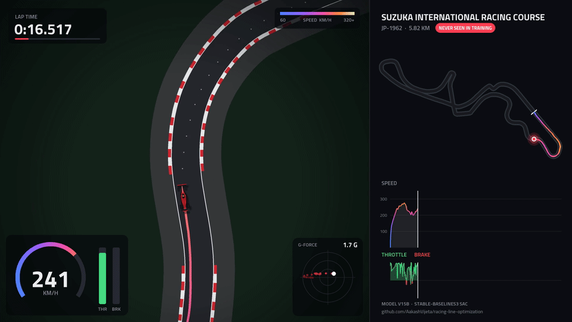

# Racing Line Optimization with Reinforcement Learning

[](https://github.com/AakashVijeta/racing-line-optimization/actions/workflows/tests.yml)
[](LICENSE)

A Soft Actor-Critic (SAC) agent that learns to drive fast laps around real-world Formula 1 circuits. The car runs in a custom Gymnasium environment with a simplified F1 vehicle model. It is trained on 37 real circuits plus 400 procedurally generated ones, and scored on circuits it never saw during training, including Suzuka.



*The full lap in 1080p60: [suzuka_lap.mp4](https://github.com/AakashVijeta/racing-line-optimization/releases/download/models-v1/suzuka_lap.mp4)*

> **TL;DR:** the current model (`v15b`) finishes **48 of 50 generated tracks it has never seen**, against 21/50 for a model trained only on real circuits, and laps the held-out **Suzuka in 1:27.9**.

---

## Highlights

- **40 real circuits**, loaded from GeoJSON, projected to local metric coordinates, and resampled with more points in tight corners.
- **Procedural track generator** producing realistic circuits for training, validation and a held-out test set.
- **Vehicle model** with an F1-like grip limit (traction circle), aerodynamic downforce that grows with speed, drag, and kinematic bicycle steering.
- **Continuous control**: the agent outputs steering and throttle/brake as two values in `[-1, 1]`.
- **Generalization tested on holdout tracks**: Suzuka, Monaco, Spa and 50 generated tracks are kept out of training.
- **Tools** for time trials over every track, checkpoint sweeps, live viewing, lap recording, telemetry replay, and MP4/GIF export.

## Results

One deterministic, standing-start lap per track (`python agent_eval.py --model <m> --procedural test`). The current model, `v15b`, is compared with `v14`, which was trained on the real circuits only:

| Laps completed | v14 (real circuits only) | **v15b** (real + procedural) |
|---|---|---|
| Real, train (37) | 28 | **34** |
| Real, val: Monaco, Spa (2) | 1 | 1 |
| Real, test: Suzuka (1) | 0 | **1** (1:27.900, avg 238.5 km/h) |
| Generated test tracks, never seen (50) | 21 | **48** |

v15b generalizes far better, but it drives more conservatively. On the tracks both models finish, it is slower on every one: median +5.7% on real circuits (27 tracks) and +5.1% on generated ones (21 tracks). On Spa it runs 1:40.400 against v14's 1:34.000. Its DNFs are Monaco (`mc-1929`), Jeddah (`sa-2021`), Albert Park (`au-1953`) and Mexico City (`mx-1962`), all `off_track`. The v15b model is the best validation checkpoint of its run, at 2.0M steps.

Per-track times and splits are in [`results/`](results): [`v15b.csv`](results/v15b.csv), [`v14.csv`](results/v14.csv), and [`v13.csv`](results/v13.csv) for the older real-circuit-only v13 (34/40 circuits, Suzuka 1:24.750, no generated tracks). Suzuka and the 50 generated test tracks are the unbiased generalization results: Monaco, Spa and the generated validation tracks are used to select the best checkpoint during training. The simulation does not model gears, tyre wear or elevation, so these lap times are for comparing runs inside this simulator. They cannot be compared with real F1 lap times.

### What I learned

- **Entropy can quietly eat the reward.** With SAC's auto-tuned entropy on narrow, randomized tracks, the entropy cost grew until it cancelled the progress reward, and crashing early became the best policy. Capping the coefficient fixed it (see [Training](#5-training-sac_trainpy)).
- **A penalty the agent can postpone is a discounted penalty.** Stopping before a hard corner and waiting for the stall timeout cost less than crashing, so several models learned to park. The stall rule now fires fast enough that parking is always worse (see [Reward](#3-environment-racing_envpy)).
- **Generalization needs varied data, not more laps of the same tracks.** Adding generated tracks and domain randomization took unseen-track completion from 21/50 to 48/50.
- **An SB3 checkpoint is not the whole training state.** The replay buffer isn't saved, so a resumed run trained on a narrow buffer and its validation score dropped sharply.

## How It Works

```
circuits/*.geojson ──► track_preprocessing.py ──► tracks/*.npy ──► RacingEnv (racing_env.py)
  (lon/lat lines)       project · dedupe ·         (centerline      │  Car (car.py)
                        adaptive resample           in metres)      ▼
                                                               SAC agent (sac_train.py)
```

### 1. Track preprocessing (`track_preprocessing.py`)
- Loads the `LineString` centerline from each GeoJSON file.
- Converts longitude/latitude to local metres with an equirectangular projection around the first point.
- Removes duplicate points, including the repeated closing point, which would otherwise create a fake curvature spike at the start/finish line.
- Fits a **centripetal Catmull-Rom spline** through the raw points. The GeoJSON points are 12–38 m apart, so a plain polyline would have zero curvature along each segment and a kink at every vertex.
- **Resamples by curvature**: point density is `1 + 3·κ_normalized`, with curvature smoothed over about 20 m and wrapping around the loop. The point count is set so straights get 5 m spacing and the tightest corners about 1.25 m (926–1,645 points per track).
- Caches the result to `tracks/<id>.npy`. `tracks/manifest.json` records the preprocessing version and settings used for each file, and `prepare_tracks()` rebuilds any track that is missing or out of date. To rebuild everything, run `python track_preprocessing.py --force`.

### 2. Vehicle model (`car.py`)
| Parameter | Value | Notes |
|---|---|---|
| Wheelbase `L` | 3.5 m | Kinematic bicycle model |
| Base lateral grip | 44.1 m/s² (~4.5 G) | Mechanical grip |
| Downforce | `+0.005·v²` | ~7 G total at 250 km/h |
| Drag | `0.0022·v²` | Top speed ~340 km/h |
| Max throttle / brake | +20 / −40 m/s² | Mapped from action `[-1, 1]` |
| Max steering | ±0.4 rad | |

At each step, the combined longitudinal and lateral acceleration demand is capped to a **traction circle** whose radius depends on speed. The steering angle the car actually achieves is worked back from the lateral acceleration left over after that cap.

### 3. Environment (`racing_env.py`)
A `gymnasium.Env` that picks a track from the pool at every `reset()`, uniformly or by weights (`set_track_weights`). Pass `options={"track": id}` to choose one.

**Observation.** There are three layouts (`obs_version`). The model registry in `config.OBS_VERSIONS` picks the right one for each model.

| Version | Models | Size | Contents |
|---|---|---|---|
| 1 | v10–v13 | 65 | speed, lateral offset, heading error; 20 lookahead points (distance, angle, \|curvature\|) snapped to centerline vertices; distance to each edge measured to the nearest boundary vertex |
| 2 | v14 | 65 | same, but lookahead points are interpolated along the centerline and edge distances are measured to the nearest boundary segment |
| 3 | v15+ | 68 | version 2 plus the absolute track width, the previous action, and **signed** curvature (left vs right) |

Lookahead points are 10 m apart, covering 200 m.

**Action**: `[steering, throttle]`, each in `[-1, 1]`. Negative throttle brakes.

**Reward**: all terms are per metre, so the scale is the same on short and long tracks.
- `+0.1` per metre of progress along the centerline
- a time penalty that breaks even at 6 m/s
- a penalty on steering changes between steps, to reduce jitter
- `−45` and end of episode for going off track or driving backwards
- `−75` and end of episode for stalling: under 2 m/s for 0.25 s (after a 3 s grace period), or under 5 m of progress in 10 s. A penalty the agent can postpone gets discounted, so it must beat a crash even after the longest delay available: braking from about 90 m/s takes about 2.3 s, and −75 × 0.995⁵⁰ ≈ −58 < −45. Earlier versions used a 2 s window and −60, which discounted to about −45: a tie with crashing. Models learned to brake to a stop before hard corners (v13 on Miami, v14 on Bahrain, and v15/v15b in some training episodes). v15b was trained under that older rule. It is evaluated under the current one, and no model trained with the new rule has been through a full run yet.
- `+10` for completing a lap

**Domain randomization** (`randomize=True`, training only). Each episode:
- scales the track width by 0.7–1.2× (clamped to 8–16 m);
- mirrors the track and/or drives it in reverse, each with probability 0.5;
- starts at a random point on the lap, up to 30% of the half-width off the centerline, with small heading noise, at up to 80% of the speed the next 150 m of corners allows.

With a random start, a lap is one full track length of progress. Evaluation always uses the standard standing start.

The nearest centerline point is searched within a ±30-point window of the previous one. This stops the car's position from jumping to the other side of a figure-of-eight crossover such as the one at Suzuka.

### 4. Procedural tracks (`track_generator.py`)
Random control polygons with added tight corners, passed through the same spline and resampling pipeline as the real circuits. A track is rejected if it crosses itself, has a corner tighter than 9 m radius, is outside 3–7 km, or has two parts closer than 20 m. The generated set is tuned to resemble the real circuits (medians):

| | Tightest corner | Lap below 100 m radius | Corners | Straights |
|---|---|---|---|---|
| Real circuits | 15.4 m | 17.8% | 20 | 61% |
| Generated | 12.2 m | 16.5% | 18 | 48% |

There are three fixed pools (`config.PROC_SEEDS` / `PROC_SIZES`): 400 training, 16 validation and 50 test tracks, with widths of 8–16 m. The test pool is never used for training or checkpoint selection. As a baseline, v14 (trained only on real circuits) finishes 28/37 of its training circuits but only **21/50** unseen generated tracks with the current car model, against **48/50** for v15b (see [Results](#results)).

### 5. Training (`sac_train.py`)
- Stable-Baselines3 SAC, `MlpPolicy` with `[512, 512, 256]` hidden layers, 8 parallel `SubprocVecEnv` workers
- `γ = 0.995`, batch 512, replay buffer 2M, 10k random warm-up steps
- **Entropy**: auto-tuned from 0.02, with target entropy −4 (`--target-entropy`) and a hard cap of 0.02 (`--max-ent-coef`). Without the cap, the first v15 run collapsed. On narrow, randomized tracks the policy kept trying to be more precise than the default target (−2) allows, so the coefficient climbed. By 2M steps the entropy cost (−α·log π, about −0.13 per step) had cancelled the progress reward (about +0.13 per step), and stopping or crashing early became the best option.
- **Learning rate** decays linearly from 3e-4 to 3e-5
- **Gradient steps**: 2 per vectorized step (0.25 updates per sample; v14 used 0.125). This runs at about 455 fps (about 5 h for 8M steps), against 866 fps with `--gradient-steps 1`.
- **Training mix**: the 37 real training circuits plus 400 generated tracks, half the episodes each (`--proc-frac`), with domain randomization
- **Adaptive sampling**: each real circuit is sampled in proportion to 0.5 + its recent failure rate, so hard tracks get more practice
- **Model selection**: every 100k steps the policy drives one lap on each validation track (Monaco, Spa and 16 generated). Each lap scores 1 + average speed/100 if finished, or the fraction of the lap covered if not. The best mean score is saved to `best_model/`, and every score is logged to `validation_history.csv`.
- TensorBoard logs lap-completion rate and mean progress separately for real and generated tracks (`train_real/`, `train_proc/`, `val_*`). These are more useful than `ep_rew_mean`, which mostly reflects track length.
- Training stops early if the entropy coefficient goes above 0.35. This only matters with the cap disabled (`--max-ent-coef 0`).
- Each run writes to `models/<run>/`, including `train_config.json` with its settings and the git commit it was trained from, and the script refuses to start if that directory already exists, unless `--resume` is passed
- **Resuming** (`--resume`) continues from the newest checkpoint with the run's saved settings, so the learning-rate schedule picks up where it stopped. The best validation score is read back from `validation_history.csv`, so a worse model never replaces `best_model/`. The replay buffer is not saved in checkpoints. The policy drives for `--refill` steps (default 100k) with no updates to refill it, but training still runs on far less varied data than before. When v15b was resumed at 2.95M steps, validation fell from 15–17/18 to 9–13/18 laps. A crashed run is often better restarted from scratch.

## Project Structure

```
.
├── config.py                 # Track IDs, widths, train/val/test split, model registry
├── car.py                    # Vehicle dynamics model
├── racing_env.py             # Gymnasium environment
├── track_preprocessing.py    # GeoJSON → metric centerline pipeline, curvature
├── track_generator.py        # Procedural track generator and fixed train/val/test pools
├── plot_track.py             # Geometry helpers: boundaries, oval generator, on-track check
├── sac_train.py              # SAC training (real + procedural tracks, randomization)
├── agent_eval.py             # Headless time trial on all tracks → leaderboard CSV
├── checkpoint_sweep.py       # Time-trial and rank a run's checkpoints
├── sac_eval.py               # Visual evaluation, cycling through random tracks
├── watch_agent.py            # Visual evaluation on one chosen track, with live telemetry
├── record_lap.py             # Record one lap (telemetry + track + metadata) to an .npz
├── lap_render.py             # Broadcast-style lap renderer: chase cam, map, telemetry, G-G diagram
├── replay.py                 # Interactive replay window
├── export_video.py           # Render a lap to MP4 + looping GIF + poster PNG
├── f1_car.py                 # Top-down F1 car sprite
├── assets/                   # README media and the bundled Titillium Web font (OFL)
├── circuits/                 # Source GeoJSON circuit layouts (40), from bacinger/f1-circuits
├── tracks/                   # Preprocessed centerlines (.npy cache)
├── results/                  # Time-trial results per model (agent_eval.py)
├── tests/                    # pytest suite
└── .github/workflows/        # CI: runs the tests on every push
```

## Getting Started

### Requirements
- Python 3.14 (the version everything was developed and tested with; CI runs the tests on it too)
- A display, for the pygame viewers

### Installation
```bash
git clone https://github.com/AakashVijeta/racing-line-optimization.git
cd racing-line-optimization
python -m venv .venv && source .venv/bin/activate
pip install -r requirements.txt       # or requirements-lock.txt for the exact versions used
```

### Download the pretrained models
Trained weights are not in the repository. The current model, v15b, is attached to the [`models-v1` release](https://github.com/AakashVijeta/racing-line-optimization/releases/tag/models-v1). Download it to the path in `config.MODEL_PATHS`:
```bash
curl -fL --create-dirs -o models/sac_v15b/best_model/best_model.zip \
  https://github.com/AakashVijeta/racing-line-optimization/releases/download/models-v1/sac_v15b.zip
python watch_agent.py                 # watch v15b drive Suzuka
```
The older models in the results tables (v13, v14) are not published.
Saved SB3 models are pickles, so if one fails to load, install `requirements-lock.txt`.

### Train
```bash
python sac_train.py --run sac_v16                         # defaults: real + procedural, randomized (v15b's settings)
python sac_train.py --run sac_v16 --proc-frac 0.7 --timesteps 10000000
python sac_train.py --run sac_v16 --resume                # continue an interrupted run
tensorboard --logdir tb_logs                               # monitor progress
```
Options:
- `--timesteps` (default 8M), `--n-envs` (8), `--seed` (0)
- `--proc-frac` (0.5; 0 trains on real circuits only), `--proc-train` (number of generated tracks)
- `--no-randomize`, `--no-adaptive`
- `--lr` / `--lr-final`, `--gradient-steps` (2), `--eval-freq` (100k)
- `--target-entropy` (−4), `--max-ent-coef` (0.02; 0 disables the cap)
- `--warm-start` (must use the same observation layout)
- `--resume` (continue `models/<run>/` from its latest checkpoint with its saved settings; `--timesteps` can extend the run), `--refill` (100k; steps collected before updates restart)

Training takes hours. Launch it with `nohup python -u sac_train.py ... > logs/<run>.log 2>&1 &` so it survives closing the terminal or editor.

Checkpoints go to `models/<run>/checkpoints/` and the best model to `models/<run>/best_model/`. To evaluate the new model by name, add it to `MODEL_PATHS` in `config.py`, or pass the `.zip` path to `--model`.

### Evaluate
```bash
python agent_eval.py                          # headless time trial on all 40 circuits -> results/v15b.csv
python agent_eval.py --procedural test        # ...plus the 50 held-out generated tracks
python watch_agent.py --track mc-1929         # watch one track (default: Suzuka)
python sac_eval.py                            # watch laps on random tracks
```
To choose a checkpoint from a training run, time-trial several of them:
```bash
python checkpoint_sweep.py --run sac_v15b                  # every 250k steps from 2M, plus best/final
python checkpoint_sweep.py --run sac_v15b --proc-test --workers 4
```
The sweep ranks checkpoints by laps completed on real train and val circuits plus the generated validation tracks, then by mean lap time on tracks every candidate finished. Suzuka and the generated test tracks (`--proc-test`) are reported but never used for ranking, so they stay fair tests of generalization. Results go to `models/<run>/checkpoint_sweep.csv`.

All of these take `--model` (a key from `config.MODEL_PATHS` or a `.zip` path; the default is `DEFAULT_MODEL_VERSION`, currently `v15b`). `agent_eval.py` writes to `results/<model>.csv` unless you pass `--out`. They also take `--obs-version`, which overrides the observation layout inferred from the model: the registry for named models, the input size for `.zip` paths (68 → 3, 65 → 2). Version 1 is never guessed, so pass `--obs-version 1` for an unregistered pre-v14 model.

### Record, replay and export a lap
```bash
python record_lap.py                          # Suzuka with the default model -> suzuka_lap.npz
python record_lap.py --track be-1925 --out spa_lap.npz
python replay.py spa_lap.npz                  # interactive: SPACE pause, ←/→ seek 1 s (SHIFT: 5 s), R restart
python export_video.py spa_lap.npz            # assets/spa_lap.mp4 (1080p60) + .gif + .png poster
```
The video is drawn in a broadcast style: a chase camera with kerbs, the racing line coloured by speed and the line still to come, a speed dial, throttle/brake bars and a G-G diagram, next to a circuit map and speed and pedal traces that fill in over the lap. `lap_render.py` draws every frame at 2× and scales it down for anti-aliasing, and frames are piped straight into ffmpeg. The GIF is cut from the MP4 with a two-pass palette, using the 10 s with the most cornering unless you pass `--gif-start`. `export_video.py` also takes `--width/--height`, `--fps`, `--gif-length`, `--gif-width` and `--skip-mp4` (rebuild only the GIF and poster). `record_lap.py` saves nothing if the agent fails to finish the lap.

### Tests
```bash
pytest
```

## Circuits

| ID | Circuit | ID | Circuit |
|---|---|---|---|
| `ae-2009` | Yas Marina | `it-1914` | Mugello |
| `ar-1952` | Buenos Aires (Gálvez) | `it-1922` | Monza |
| `at-1969` | Red Bull Ring | `it-1953` | Imola |
| `au-1953` | Albert Park | `jp-1962` | Suzuka *(test holdout)* |
| `az-2016` | Baku City Circuit | `mc-1929` | Monaco *(validation holdout)* |
| `be-1925` | Spa-Francorchamps *(validation holdout)* | `mx-1962` | Hermanos Rodríguez |
| `bh-2002` | Bahrain International | `my-1999` | Sepang |
| `br-1940` | Interlagos | `nl-1948` | Zandvoort |
| `br-1977` | Jacarepaguá | `pt-1972` | Estoril |
| `ca-1978` | Gilles-Villeneuve | `pt-2008` | Portimão |
| `cn-2004` | Shanghai International | `qa-2004` | Losail |
| `de-1927` | Nürburgring | `ru-2014` | Sochi Autodrom |
| `de-1932` | Hockenheimring | `sa-2021` | Jeddah Corniche |
| `es-1991` | Barcelona-Catalunya | `sg-2008` | Marina Bay |
| `es-2026` | Madring (Madrid) | `tr-2005` | Istanbul Park |
| `fr-1960` | Magny-Cours | `us-1909` | Indianapolis |
| `fr-1969` | Paul Ricard | `us-1956` | Watkins Glen |
| `gb-1948` | Silverstone | `us-2012` | Circuit of the Americas |
| `hu-1986` | Hungaroring | `us-2022` | Miami |
| | | `us-2023` | Las Vegas |
| | | `za-1961` | Kyalami |

Circuit layouts are from [bacinger/f1-circuits](https://github.com/bacinger/f1-circuits) by Tomislav Bacinger, used under the MIT licence ([`circuits/LICENSE.md`](circuits/LICENSE.md)). Track widths vary by circuit, from 8.5 m (Monaco) to 15 m, and are set in `config.TRACK_WIDTHS`.

## Adding a New Circuit
1. Add `circuits/<id>.geojson` containing a single `LineString` feature.
2. Add `<id>` to `TRACK_IDS` in `config.py`, and optionally set its width in `TRACK_WIDTHS` (the default is 15 m).
3. Run `python track_preprocessing.py <id>`, or any other script; `prepare_tracks()` generates `tracks/<id>.npy` the first time the track is used.

## License

MIT, see [`LICENSE`](LICENSE). The circuit data has its own MIT licence (see [Circuits](#circuits)).

## Limitations & Future Work
- The model is a 2D kinematic bicycle with no tyre slip, weight transfer, gears or elevation.
- Tight, low-speed street circuits such as Monaco are still unsolved (see the DNFs above).
- v15b trades about 5% of pace for its reliability on unseen tracks; closing that gap is the next goal.
- There are no rumble strips or track limits beyond the fixed track width.
- Possible next steps: a dynamic tyre model, curriculum learning ordered by corner difficulty, and comparison against an optimal racing line computed with a minimum-curvature solver.
